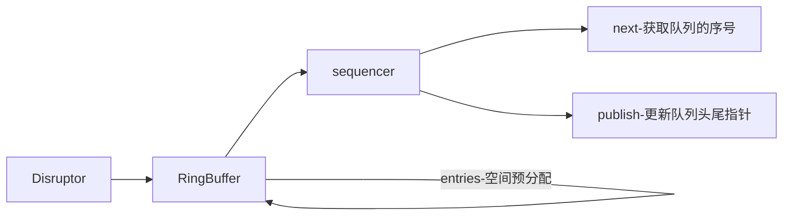

> Disruptor是英国外汇交易公司LMAX开发的一个高性能队列，研发的初衷是解决内存队列的延迟问题（在性能测试中发现竟然与I/O操作处于同样的数量级）。基于Disruptor开发的系统单线程能支撑每秒600万订单，2010年在QCon演讲后，获得了业界关注。2011年，企业应用软件专家Martin Fowler专门撰写长文介绍。同年它还获得了Oracle官方的Duke大奖。

正在使用的disruptor的开源软件

- Apache Storm
- Camel
- Log4j 2

### 源码下载

```shell
git clone https://github.com/LMAX-Exchange/disruptor
```

本文使用的版本是3.4.2

### 创建一个disruptor

```java
/**
     * Create a new Disruptor.
     *
     * @param eventFactory   the factory to create events in the ring buffer.
     * @param ringBufferSize the size of the ring buffer, must be power of 2.
     * @param threadFactory  a {@link ThreadFactory} to create threads for processors.
     * @param producerType   the claim strategy to use for the ring buffer.
     * @param waitStrategy   the wait strategy to use for the ring buffer.
     */
    public Disruptor(
            final EventFactory<T> eventFactory,
            final int ringBufferSize,
            final ThreadFactory threadFactory,
            final ProducerType producerType,
            final WaitStrategy waitStrategy)
    {
        this(
            RingBuffer.create(producerType, eventFactory, ringBufferSize, waitStrategy),
            new BasicExecutor(threadFactory));
    }
```

producerType对应具体的生产者模式。

```java
/**
 * Defines producer types to support creation of RingBuffer with correct sequencer and publisher.
 */
public enum ProducerType
{
    /**
     * Create a RingBuffer with a single event publisher to the RingBuffer
     */
    SINGLE,

    /**
     * Create a RingBuffer supporting multiple event publishers to the one RingBuffer
     */
    MULTI
}
```

使用哪个模式取决你的生产者到底是单线程还是多线程。多线程的模式在预分配的过程中会使用CAS来保证数据的一致性(同一个槽不会被不同的生产者占用)

WaitStrategy--消费者等待策略。一旦消费者的处理速度比生产者快，消费者所采用的等待策略

等待策略 | 措施 | 适用场景
- | - | -
BlockingWaitStrategy | 加锁 | CPU资源紧缺，吞吐量和延迟并不重要的场景
BusySpinWaitStrategy | 自旋 | 通过不断重试，减少切换线程导致的系统调用，而降低延迟。推荐在线程绑定到固定的CPU的场景下使用
PhasedBackoffWaitStrategy | 自旋 + yield + 自定义策略 | CPU资源紧缺，吞吐量和延迟并不重要的场景
SleepingWaitStrategy | 自旋 + yield + sleep | 性能和CPU资源之间有很好的折中。延迟不均匀
TimeoutBlockingWaitStrategy | 加锁，有超时限制 | CPU资源紧缺，吞吐量和延迟并不重要的场景
YieldingWaitStrategy | 自旋 + yield + 自旋 | 性能和CPU资源之间有很好的折中。延迟比较均匀

具体的等待策略的源码暂时不在这里做分析

创建RingBuffter，disruptor适用的一个环状缓冲结构。RingBuffer有一个很核心的组件sequencer。多生产者模式和单生产者模式的主要区别就是在这里。我们先在脑海里记得有这么个组件，它的主要作用后面再进行分析。


### 生产者

我们先关注最简单的单生产者的模式。下面的方法是最常用的，把参数arg0转化成泛型E，然后写入到队列。

RingBuffer.java

```java
/**
     * @see com.lmax.disruptor.EventSink#publishEvent(com.lmax.disruptor.EventTranslatorOneArg, Object)
     * com.lmax.disruptor.EventSink#publishEvent(com.lmax.disruptor.EventTranslatorOneArg, A)
     */
    @Override
    public <A> void publishEvent(EventTranslatorOneArg<E, A> translator, A arg0)
    {
        final long sequence = sequencer.next();
        translateAndPublish(translator, sequence, arg0);
    }

```

调用关系图



何如获取RingBuffer下一个槽的序号？

```java
/**
     * @see Sequencer#next(int)
     */
    @Override
    public long next(int n)
    {
        if (n < 1)
        {
            throw new IllegalArgumentException("n must be > 0");
        }

        long nextValue = this.nextValue;

        long nextSequence = nextValue + n;
        long wrapPoint = nextSequence - bufferSize;
        long cachedGatingSequence = this.cachedValue;

        if (wrapPoint > cachedGatingSequence || cachedGatingSequence > nextValue)
        {
            cursor.setVolatile(nextValue);  // StoreLoad fence

            long minSequence;
            while (wrapPoint > (minSequence = Util.getMinimumSequence(gatingSequences, nextValue)))
            {
                LockSupport.parkNanos(1L); // TODO: Use waitStrategy to spin?
            }

            this.cachedValue = minSequence;
        }

        this.nextValue = nextSequence;

        return nextSequence;
    }
```

对于单生产者来说，只需要针对nextValue进行自增。注意单生产者没有对nextValue进行加锁，如果是多生产者的模式则需要对nextValue用CAS的方式保证nextValue的线程安全。

我们增加一个单元测试来关注sequencer的属性变化。

```java
@Test
    public void next(){
        SingleProducerSequencer sequencer = new SingleProducerSequencer(16, new BusySpinWaitStrategy());
        for (int i = 0; i < 32; i++){
            long next = sequencer.next();
            sequencer.publish(next);
            System.out.println("cursor:"+sequencer.cursor);
            System.out.println("nextValue:"+sequencer.nextValue);
            System.out.println("wrapPoint:"+(sequencer.nextValue-sequencer.bufferSize));
            System.out.println("cachedValue:"+sequencer.cachedValue);
            String values="";
            for(Sequence sequence:sequencer.gatingSequences){
                values+=sequence.get()+",";
            }
            System.out.println("gatingSequences:"+values);
            System.out.println();
        }
    }
```

```
cursor:0
nextValue:0
wrapPoint:-16
cachedValue:-1
gatingSequences:

cursor:1
nextValue:1
wrapPoint:-15
cachedValue:-1
gatingSequences:

...

cursor:15
nextValue:15
wrapPoint:-1
cachedValue:-1
gatingSequences:

cursor:16
nextValue:16
wrapPoint:0
cachedValue:15
gatingSequences:
...

cursor:31
nextValue:31
wrapPoint:15
cachedValue:15
gatingSequences:


Process finished with exit code 0
```

wrapPoint相当于RingBuffer的头指针

cursor相当于RingBuffer的尾指针

### 消费者

BatchEventProcessor是EventProcessor的子类。

```java
private void processEvents()
    {
        T event = null;
        long nextSequence = sequence.get() + 1L;

        while (true)
        {
            try
            {
                //这里涉及到消费者的等待策略的逻辑
                final long availableSequence = sequenceBarrier.waitFor(nextSequence);
                if (batchStartAware != null)
                {
                    batchStartAware.onBatchStart(availableSequence - nextSequence + 1);
                }
                while (nextSequence <= availableSequence)
                {
                    event = dataProvider.get(nextSequence);
                    //消费者事件执行的逻辑
                    eventHandler.onEvent(event, nextSequence, nextSequence == availableSequence);
                    nextSequence++;
                }

                sequence.set(availableSequence);
            }
            ...
        }
    }
```


问题

- disruptor为什么快？
- SequenceBarrier的作用？
- disruptor的handleEventsWithWorkerPool和handleEventsWith的区别？

### 参考文献

[高性能队列——Disruptor](https://tech.meituan.com/2016/11/18/disruptor.html)

[并发框架Disruptor译文](https://ifeve.com/disruptor/)

[disruptor github](https://github.com/LMAX-Exchange/disruptor)

[dissecting-disruptor-wiring-up](http://ifeve.com/dissecting-disruptor-wiring-up/)

重点关注 **How consumer dependencies work in the Disruptor** 

[如何使用Disruptor（二）如何从Ringbuffer读取](https://ifeve.com/dissecting_the_disruptor_how_doi_read_from_the_ring_buffer)

比较重要，介绍RingBuffer的数据读取流程。