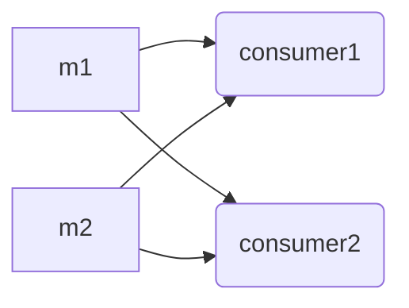
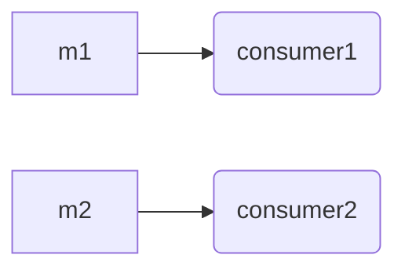
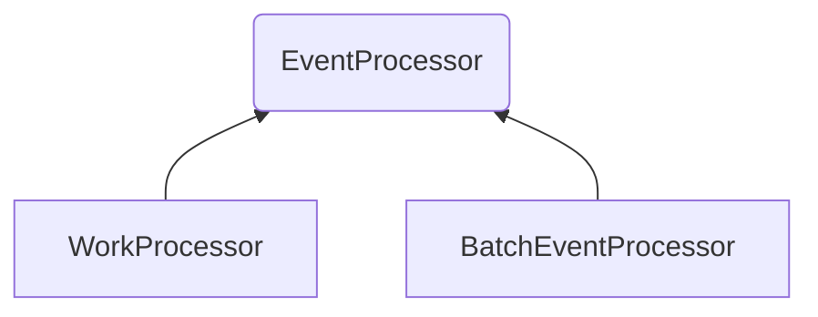
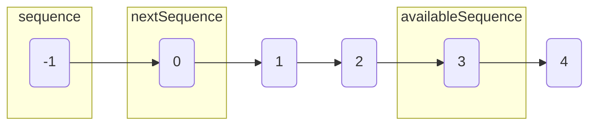
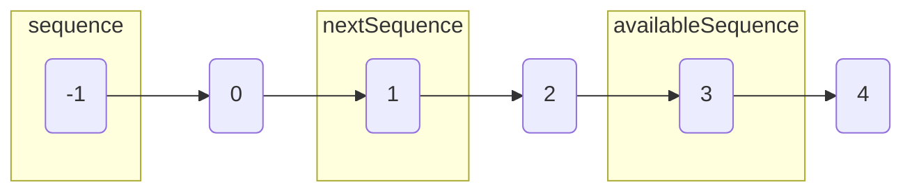
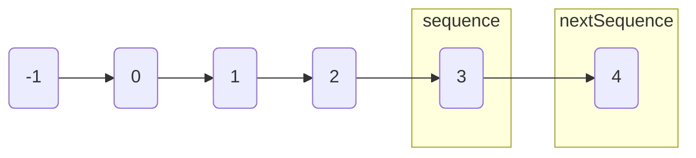

在分析Disruptor的消费者的处理逻辑的时候，如果有多个消费者，Disruptor如何处理这些消费者的竞争关系？
handleEventsWith和handleEventsWithWorkerPool又有什么区别？

我自己简单写了一个测试类来进行测试。
```java
package com.lmax.disruptor.example;

import com.lmax.disruptor.*;
import com.lmax.disruptor.dsl.Disruptor;
import com.lmax.disruptor.dsl.ProducerType;
import com.lmax.disruptor.util.DaemonThreadFactory;

/**
 * @Auther: 李泳权
 * @Date: 2019/10/10 14:05
 * @Description:
 */
public class SimpleDisruptorTest {
    static final int RING_SIZE = 8;
    public static void main(String[] args) throws InterruptedException
    {
        Disruptor<SimpleMessage> disruptor = new Disruptor<>(
                SimpleMessage.FACTORY, RING_SIZE, DaemonThreadFactory.INSTANCE, ProducerType.MULTI,
                new BlockingWaitStrategy());
        //disruptor.handleEventsWith(new Consumer()).then(new Consumer());
        //disruptor.handleEventsWith(new Consumer[]{new Consumer(),new Consumer()});
        disruptor.handleEventsWithWorkerPool(new Consumer[]{new Consumer(),new Consumer()});
        final RingBuffer<SimpleMessage> ringBuffer = disruptor.getRingBuffer();
        Publisher p = new Publisher();
        System.out.println("publishing " + RING_SIZE + " messages");
        int i = 0;
        for (; i < RING_SIZE; i++)
        {
            ringBuffer.publishEvent(p, (long)i);
            Thread.sleep(10);
        }
        System.out.println("start disruptor");
        disruptor.start();
        System.out.println("continue publishing");
        while (true)
        {
            ringBuffer.publishEvent(p, (long)i);
            Thread.sleep(10);
            i++;
        }
    }

    public static class Publisher implements EventTranslatorOneArg<SimpleMessage, Long>
    {
        @Override
        public void translateTo(SimpleMessage message, long sequence,Long value)
        {
            message.setValue(value);
            message.setSequence(sequence);
        }
    }

    public static class Consumer implements EventHandler<SimpleMessage>,WorkHandler<SimpleMessage>
    {
        @Override
        public void onEvent(SimpleMessage event, long sequence, boolean endOfBatch) throws Exception
        {
            System.out.println("sequence:"+sequence+","+"event:"+event.toString());
        }

        @Override
        public void onEvent(SimpleMessage event) throws Exception {
            System.out.println("event:"+event.toString());
        }
    }

    public static class SimpleMessage{
        private long value;
        private long sequence;
        private static final EventFactory<SimpleMessage> FACTORY = new EventFactory<SimpleMessage>()
        {
            @Override
            public SimpleMessage newInstance()
            {
                return new SimpleMessage();
            }
        };

        public long getValue() {
            return value;
        }

        public void setValue(long value) {
            this.value = value;
        }

        public long getSequence() {
            return sequence;
        }

        public void setSequence(long sequence) {
            this.sequence = sequence;
        }

        @Override
        public String toString() {
            return "SimpleMessage{" +
                    "value=" + value +
                    ", sequence=" + sequence +
                    '}';
        }
    }
}

```

对于同一条消息m，handleEventsWith会让每个消费者都分别消费一遍(消息广播)。而handleEventsWithWorkerPool的多个消费者会竞争消费，对于一条消息只会被一个消费者消费。

我们看disruptor的方法介绍

```java
    /**
     * Set up a {@link WorkerPool} to distribute an event to one of a pool of work handler threads.
     * Each event will only be processed by one of the work handlers.
     * The Disruptor will automatically start this processors when {@link #start()} is called.
     *
     * @param workHandlers the work handlers that will process events.
     * @return a {@link EventHandlerGroup} that can be used to chain dependencies.
     */
    @SafeVarargs
    @SuppressWarnings("varargs")
    public final EventHandlerGroup<T> handleEventsWithWorkerPool(final WorkHandler<T>... workHandlers)
    {
        return createWorkerPool(new Sequence[0], workHandlers);
    }
```


- handleEventsWith



- handleEventsWithWorkerPool




我们关注下下面的两个类WorkProcessor和BatchEventProcessor



handleEventsWith会创建BatchEventProcessor对象，handleEventsWithWorkerPool会构建WorkProcessor。

我们看下官方的类描述

```java
/**
 * Convenience class for handling the batching semantics of consuming entries from a {@link RingBuffer}
 * and delegating the available events to an {@link EventHandler}.
 * <p>
 * If the {@link EventHandler} also implements {@link LifecycleAware} it will be notified just after the thread
 * is started and just before the thread is shutdown.
 *
 * @param <T> event implementation storing the data for sharing during exchange or parallel coordination of an event.
 */
public final class BatchEventProcessor<T>
    implements EventProcessor
```

BatchEventProcessor是批处理事件模型。

```java
/**
 * <p>A {@link WorkProcessor} wraps a single {@link WorkHandler}, effectively consuming the sequence
 * and ensuring appropriate barriers.</p>
 *
 * <p>Generally, this will be used as part of a {@link WorkerPool}.</p>
 *
 * @param <T> event implementation storing the details for the work to processed.
 */
public final class WorkProcessor<T>
    implements EventProcessor
{
```

WorkProcessor对于每条消息只会处理一次。

我们看下BatchEventProcessor的处理逻辑。

```java
    private void processEvents()
    {
        T event = null;
        long nextSequence = sequence.get() + 1L;

        while (true)
        {
            try
            {
                final long availableSequence = sequenceBarrier.waitFor(nextSequence);
                if (batchStartAware != null)
                {
                    batchStartAware.onBatchStart(availableSequence - nextSequence + 1);
                }

                while (nextSequence <= availableSequence)
                {
                    event = dataProvider.get(nextSequence);
                    //事件触发
                    eventHandler.onEvent(event, nextSequence, nextSequence == availableSequence);
                    nextSequence++;
                }

                sequence.set(availableSequence);
            }
            ...
        }
    }

```

一开始nextSequence = sequence.get() + 1L;

availableSequence相当于写入的尾指针



nextSequence会不断地往后移。当nextSequence>availableSequence，会把sequence更新为availableSequence。然后再读取下一个availableSequence的位点







