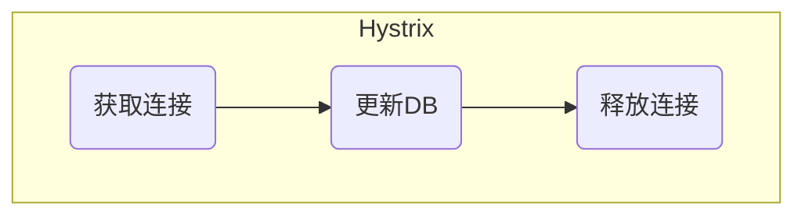

 最近在线上环境发现Druid连接池出现了InterruptedException异常，其实涉及到锁的使用，这篇文章我们尝试分析下连接池和可重入锁的实现，来对这个问题进行一个比较全面的分析。

异常堆栈内容如下：

```java
	java.lang.InterruptedException
at java.util.concurrent.locks.AbstractQueuedSynchronizer.acquireInterruptibly(AbstractQueuedSynchronizer.java:1220)
at java.util.concurrent.locks.ReentrantLock.lockInterruptibly(ReentrantLock.java:335)
at com.alibaba.druid.pool.DruidDataSource.recycle(DruidDataSource.java:1281)
at com.alibaba.druid.pool.DruidPooledConnection.recycle(DruidPooledConnection.java:297)
at com.alibaba.druid.pool.DruidPooledConnection.close(DruidPooledConnection.java:247)
at com.kugou.fanxing.revenue.persist.DefaultNsqMessageDao.insertOrUpdateByMessageIdAndAppId(DefaultNsqMessageDao.java:98)
at com.kugou.fanxing.revenue.persist.DefaultNsqMessageDao.insertOrUpdateByMessageIdAndAppId(DefaultNsqMessageDao.java:31)
at com.kugou.fanxing.revenue.persist.MessagePersistCommand.run(MessagePersistCommand.java:40)
at com.kugou.fanxing.revenue.persist.MessagePersistCommand.run(MessagePersistCommand.java:15)
at com.netflix.hystrix.HystrixCommand$2.call(HystrixCommand.java:302)
at com.netflix.hystrix.HystrixCommand$2.call(HystrixCommand.java:298)
```

这里我们主要提出几个问题。

- 为什么会抛这个异常
- 回收连接池吞掉这个异常是否有问题？
- 可重入锁ReentrantLock的作用？

根据这几个问题，我们再去分析下连接池回收连接的逻辑。

我们的业务场景是通过Hystrix去把DB的更新操作封装起来。



注：Druid版本为1.0.6,Hystrix版本为1.5.12

### 连接池回收

我们看下DruidPooledConnection的连接池回收逻辑

```java
public void recycle() throws SQLException {
        ...
        if (!this.abandoned) {
            DruidAbstractDataSource dataSource = holder.getDataSource();
            //回收逻辑
            dataSource.recycle(this);
        }
        ...
    }
```

最终逻辑会到DruidDataSource的recycle方法

```java
protected void recycle(DruidPooledConnection pooledConnection) throws SQLException {
    //加锁
    lock.lockInterruptibly();
            try {
                activeCount--;
                closeCount++;

                putLast(holder, lastActiveTimeMillis);
                recycleCount++;
            } finally {
                lock.unlock();
            }
    } catch (Throwable e) {
            holder.clearStatementCache();

            if (!holder.isDiscard()) {
                this.discardConnection(physicalConnection);
                holder.setDiscard(true);
            }

            LOG.error("recyle error", e);
            recycleErrorCount.incrementAndGet();
        }
        
}
```

lock是ReentrantLock类的一个对象。如果当前线程已经被中断，这里会抛异常。但是异常处理的其实只会简单打一个回收异常。

我们再看看Hystrix的处理逻辑。

HystrixCommand.java

```java
public Future<R> queue() {
    ...
if (!isExecutionComplete() && interruptOnFutureCancel.get()) {
                    final Thread t = executionThread.get();
                    if (t != null && !t.equals(Thread.currentThread())) {
                        //把当前线程设置为中断
                        t.interrupt();
                    }
                }
    ...
}
```

如果执行失败会把当前线程设置为中断。

#### 结论

当Hystrix执行超时或者执行失败，会导致Druid连接池回收失败

### 参考文献

https://www.cnblogs.com/lingyejun/p/9064114.html

