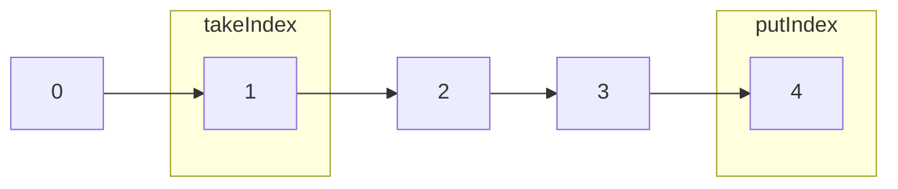
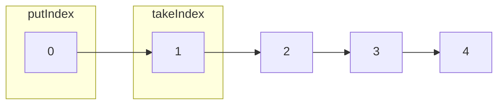

之前看过Disruptor的实现，然而如果需要真正地了解Disruptor的为什么快，我们需要对既有的内存队列做一个分析(没有对比就没有伤害)。

下面列举了一些常见的内存队列：

| 队列                  | 有界性             | 锁   | 数据结构   |
| -- | -- | -- | -- |
| ArrayBlockingQueue    | bounded            | 加锁 | arraylist  |
| LinkedBlockingQueue   | optionally-bounded | 加锁 | linkedlist |
| ConcurrentLinkedQueue | unbounded          | 无锁 | linkedlist |
| LinkedTransferQueue   | unbounded          | 无锁 | linkedlist |
| PriorityBlockingQueue | unbounded          | 加锁 | heap       |
| DelayQueue            | unbounded          | 加锁 | heap       |

我将重点分析前面3个队列。

- ArrayBlockingQueue
- LinkedBlockingQueue
- ConcurrentLinkedQueue


这3个类同样继承AbstractQueue

### 接口Queue的定义

先来复习一下queue接口的定义。

```java
public interface Queue<E> extends Collection<E> {
    /**
     * Inserts the specified element into this queue if it is possible to do so
     * immediately without violating capacity restrictions, returning
     * {@code true} upon success and throwing an {@code IllegalStateException}
     * if no space is currently available.
     *
     * @param e the element to add
     * @return {@code true} (as specified by {@link Collection#add})
     * @throws IllegalStateException if the element cannot be added at this
     *         time due to capacity restrictions
     * @throws ClassCastException if the class of the specified element
     *         prevents it from being added to this queue
     * @throws NullPointerException if the specified element is null and
     *         this queue does not permit null elements
     * @throws IllegalArgumentException if some property of this element
     *         prevents it from being added to this queue
     */
    boolean add(E e);

    /**
     * Inserts the specified element into this queue if it is possible to do
     * so immediately without violating capacity restrictions.
     * When using a capacity-restricted queue, this method is generally
     * preferable to {@link #add}, which can fail to insert an element only
     * by throwing an exception.
     *
     * @param e the element to add
     * @return {@code true} if the element was added to this queue, else
     *         {@code false}
     * @throws ClassCastException if the class of the specified element
     *         prevents it from being added to this queue
     * @throws NullPointerException if the specified element is null and
     *         this queue does not permit null elements
     * @throws IllegalArgumentException if some property of this element
     *         prevents it from being added to this queue
     */
    boolean offer(E e);

    /**
     * Retrieves and removes the head of this queue.  This method differs
     * from {@link #poll poll} only in that it throws an exception if this
     * queue is empty.
     *
     * @return the head of this queue
     * @throws NoSuchElementException if this queue is empty
     */
    E remove();

    /**
     * Retrieves and removes the head of this queue,
     * or returns {@code null} if this queue is empty.
     *
     * @return the head of this queue, or {@code null} if this queue is empty
     */
    E poll();

    /**
     * Retrieves, but does not remove, the head of this queue.  This method
     * differs from {@link #peek peek} only in that it throws an exception
     * if this queue is empty.
     *
     * @return the head of this queue
     * @throws NoSuchElementException if this queue is empty
     */
    E element();

    /**
     * Retrieves, but does not remove, the head of this queue,
     * or returns {@code null} if this queue is empty.
     *
     * @return the head of this queue, or {@code null} if this queue is empty
     */
    E peek();
}
```

- add

添加一个元素到队列

- offer

添加一个元素到队列。跟add的区别是，add添加失败后会抛异常，而offer是返回false。

- remove

出队

- poll

出队，跟remove的区别是，队列为空，remove抛异常，而poll会返回一个null

- element

返回队列的头，不会删除。

- peek

返回队列的头，不会删除。跟element的区别是，如果队列为空，element抛异常，而peek返回null

一般业务使用offer,poll,peek居多。

### ArrayBlockingQueue

顾名思义，使用数组存储队列的元素。通过一个写指针(putIndex)和取指针(takeIndex)来控制队列的入队和出队。



当putIndex=数组的大小时，指针又会回到0。

如图，下一个元素入队会导致putIndex到达0。



当putIndex和takeIndex到达同一个位置，有两种可能。

- 队列已满
- 队列为空

ArrayBlockingQueue通过一个属性count来区分这两种场景。

- 队列已满。如果写入会阻塞生产者(有两个offer方法，带timeout的才会阻塞)
- 队列为空。如果出队会阻塞消费者(有两个poll方法，带timeout的才会阻塞)

下面看下源码

1. 入队

```java
public boolean offer(E e, long timeout, TimeUnit unit)
        throws InterruptedException {

        checkNotNull(e);
        long nanos = unit.toNanos(timeout);
        final ReentrantLock lock = this.lock;
    //加锁
        lock.lockInterruptibly();
        try {
            //队列已满，等待timeout
            while (count == items.length) {
                if (nanos <= 0)
                    return false;
                nanos = notFull.awaitNanos(nanos);
            }
            //入队
            enqueue(e);
            return true;
        } finally {
            lock.unlock();
        }
    }
private void enqueue(E x) {
        // assert lock.getHoldCount() == 1;
        // assert items[putIndex] == null;
        final Object[] items = this.items;
        items[putIndex] = x;
    //队列已满，指针回到0点
        if (++putIndex == items.length)
            putIndex = 0;
        count++;
    //唤醒阻塞等待的生产者
        notEmpty.signal();
    }
```

2. 出队

```java
public E poll(long timeout, TimeUnit unit) throws InterruptedException {
        long nanos = unit.toNanos(timeout);
        final ReentrantLock lock = this.lock;
    //加锁
        lock.lockInterruptibly();
        try {
            //队列为空，阻塞等待
            while (count == 0) {
                if (nanos <= 0)
                    return null;
                nanos = notEmpty.awaitNanos(nanos);
            }
            return dequeue();
        } finally {
            lock.unlock();
        }
    }
private E dequeue() {
        // assert lock.getHoldCount() == 1;
        // assert items[takeIndex] != null;
        final Object[] items = this.items;
        @SuppressWarnings("unchecked")
        E x = (E) items[takeIndex];
    //对象置位空
        items[takeIndex] = null;
    //取指针+1
        if (++takeIndex == items.length)
            takeIndex = 0;
        count--;
        if (itrs != null)
            itrs.elementDequeued();
        notFull.signal();
        return x;
    }
```

总结：

ArrayBlockingQueue是最简单的队列实现，通过锁来保证在多线程环境下的数据一致性。加锁的原因是由于putIndex和takeIndex在到达数组的length-1时，需要把指针挪回0的位置，而disruptor的指针是一直自增，可以利用AtmoicLong的CAS来保证线程安全。

### LinkedBlockingQueue

先看下官方的介绍。

```java
/**
 * An optionally-bounded {@linkplain BlockingQueue blocking queue} based on
 * linked nodes.
 * This queue orders elements FIFO (first-in-first-out).
 * The <em>head</em> of the queue is that element that has been on the
 * queue the longest time.
 * The <em>tail</em> of the queue is that element that has been on the
 * queue the shortest time. New elements
 * are inserted at the tail of the queue, and the queue retrieval
 * operations obtain elements at the head of the queue.
 * Linked queues typically have higher throughput than array-based queues but
 * less predictable performance in most concurrent applications.
```

有几点关键信息

- 头尾指针的定义
- 链表队列的吞吐量高于数组队列

对于第二点个人持保留意见。

- 数组队列在物理存储上是一个连续的空间，计算机对于这种数据的连续读取是有优化的。
- 每次的入队都需要重新申请一个内存块，数据队列的空间是预申请。
- 出队后的对象是一个死链，需要通过GC释放

LinkedBlockingQueue在锁的层面有做优化。写锁和读锁是分开，锁的粒度比ArrayBlockingQueue要小。

```java
/** Lock held by take, poll, etc */
    private final ReentrantLock takeLock = new ReentrantLock();

    /** Lock held by put, offer, etc */
    private final ReentrantLock putLock = new ReentrantLock();
```

入队

```java
public boolean offer(E e) {
        if (e == null) throw new NullPointerException();
        final AtomicInteger count = this.count;
        if (count.get() == capacity)
            return false;
        int c = -1;
        Node<E> node = new Node<E>(e);
        final ReentrantLock putLock = this.putLock;
        putLock.lock();
        try {
            if (count.get() < capacity) {
                enqueue(node);
                c = count.getAndIncrement();
                if (c + 1 < capacity)
                    notFull.signal();
            }
        } finally {
            putLock.unlock();
        }
        if (c == 0)
            signalNotEmpty();
        return c >= 0;
    }
/**
     * Links node at end of queue.
     *
     * @param node the node
     */
    private void enqueue(Node<E> node) {
        // assert putLock.isHeldByCurrentThread();
        // assert last.next == null;
        last = last.next = node;
    }
```

加锁，尾指针(last)修改

出队的逻辑雷同。

### 总结

这篇文章主要分析了ArrayBlockingQueue和LinkedBlockingQueue，这两个队列在并发的场景下，都是使用了锁来保证线程安全。ConcurrentLinkedQueue的实现会稍复杂一些，计划在下一篇文章单独进行分析。