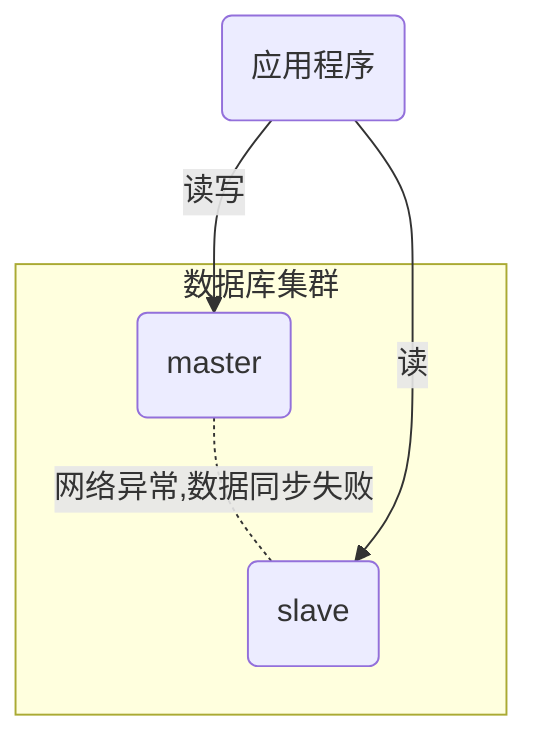
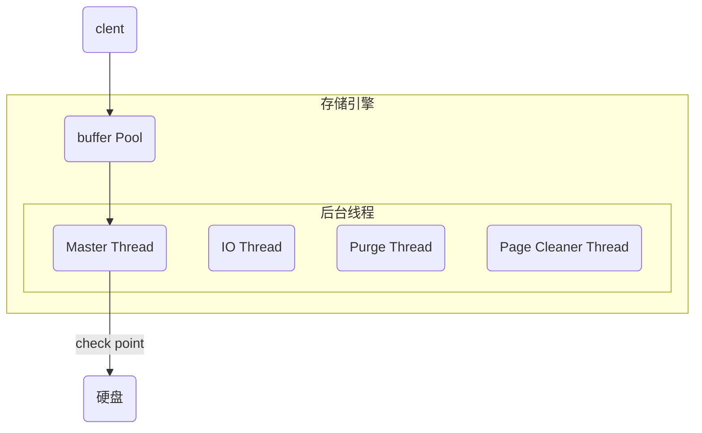
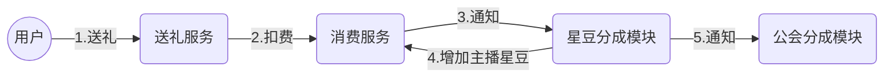
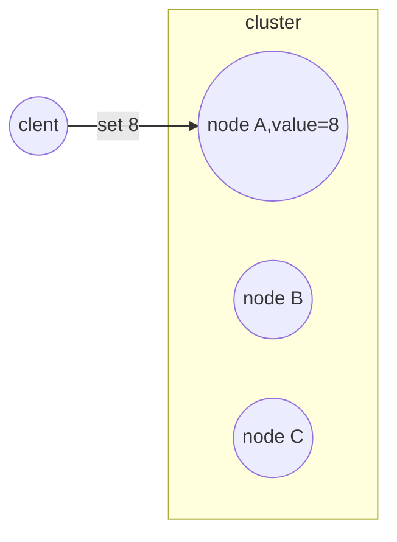
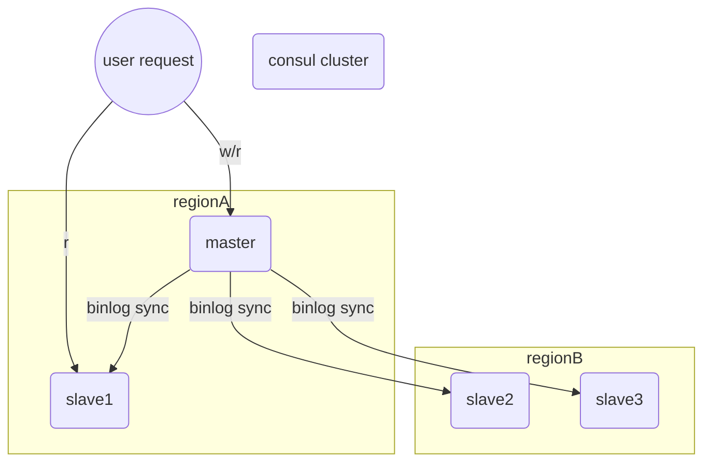

### 引言-WHY

1. 一致性的定义

   >  在数据有多分副本的情况下，如果网络、服务器或者软件出现故障，会导致部分副本写入成功，部分副本写入失败。这就造成各个副本之间的数据不一致，数据内容冲突。

   这里有几个关键词

   - 分布式环境
   - 多副本

2. 数据不一致的场景

- 网络

网络问题导致master和slave的两个副本的数据不一致。

- 硬件故障

还是拿mysql作为例子。

mysql的架构大致如下(做过大量简化，事实上mysql的实现会复杂很多)：

如果在写入buffer pool成功后，机器断电或者硬盘故障，buffer pool的数据将和硬盘的数据不一致。(事实上mysql的redo log机制可以尽力补偿这部分数据)

- 程序

我们拿直播业务的公会分成的一个业务架构举例

由于公会分成的模块不支持幂等，因此在步骤5通知公会分成失败无法通过重试来保证数据的一致性。因此公会分成和主播的分成有可能会不一致。

3. 为什么我们需要一致性 

酷七条-数据一定不能错

业务属性：营收业务

拿去年419的截图。火箭漫天飞。对公司造成重大损失。

- 弱一致性业务。
- 强一致性业务。

### 一致性问题是如何产生的

单点是不存在一致性问题的。

client设置了一个值8到node A，如何让副本node B和node C都保持一致。

讲讲经典的CAP理论(去网上偷一张图)。

一致性协议对比
|名称 | 描述 | CAP选型 | 开源软件 |
|- | - | - | - |
|主从同步 | 数据库的主从同步 | C | mysql |
|2PC | 两段提交 | * | fescar、mysql的group commit |
|paxos | quorum 协议 | CP | ocean base |
|raft | quorum 协议。paxos的工业实现版本，比paxos更易于理解和实现。增加了节点uncommit的状态 | CP | consul |
|zab | zookeeper的一致性实现算法。 | CP | zookeeper |

mysql的主从同步-CA

脑裂问题(重点)

### CAP定律

### 一致性协议&开源工具[重点]

### MHA架构，可以顺便介绍下半同步

### 金钱模块的一致性架构

### 有没有更好的方案？代理、SDK层面解决

留一道思考题？如果出现的网络场景不是不可用，而是失败率很高，应该如何解决？

仲裁节点和MHA

mha config使用consul实现，保证数据的强一致。MHA SDK在网络分区的场景下通知业务，由业务决定具体的降级方案

交由给代理层/rpc中间件解决

### 总结

### 参考

[浅偿数据一致性](https://blog.csdn.net/u013256816/article/details/50698167)

[mysql innodb架构](https://blog.csdn.net/anzhen0429/article/details/80955101)

[InnoDB 存储引擎体系架构](https://segmentfault.com/a/1190000004673132)

[MySQL读写IO的操作过程解析](https://www.cnblogs.com/drizzle-xu/p/9869406.html)

[英文动画raft协议](http://thesecretlivesofdata.com/raft/)

[CAP原理](https://blog.csdn.net/qq_28165595/article/details/81211733)