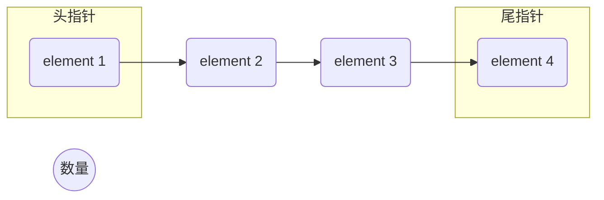

### 概要说明

前面我们分析了ArrayBlockingQueue和LinkedBlockingQueue。前面的两个队列都是阻塞队列，而ConcurrentLinkedQueue则是非阻塞队列。

阻塞队列和非阻塞队列的主要区别主要体现在功能层面：

当队列空间已满或者队列为空的场景下，消费者/生产者是否会阻塞。

从代码层面主要是看这个队列是否有实现BlockingQueue接口。其实阻塞队列和非阻塞队列的界定不是很明显，因为阻塞队列很容易就可以改造成非阻塞队列（把wait逻辑去掉，直接返回一个空对象）。同样，非阻塞队列要改造成阻塞队列也很简单，只需要增加一个Condition来对生产者和消费者来进行阻塞和唤醒的操作。因此阻塞队列和非阻塞队列并非一成不变的，很有可能哪一天开发者会扩展或者改造类的实现，因此我们后面的讨论更多是在性能上。

ConcurrentLinkedQueue相比较LinkedBlockingQueue最大的特点是性能的优化。我们可以发现，不管是ArrayBlockingQueue还是LinkedBlockingQueue，都需要维护几个核心的变量。

- 头指针
- 尾指针
- 元素的数量

我们假设需要增加一个元素5，需要有3步操作。

1. 把element 4的next指针指向一个新的元素element 5
2. 修改尾指针指向element 5
3. 修改元素的数量+1

为了保证这3个步骤的数据的一致性，我们需要通过锁来保证这3个操作的原子性。我们知道在并发场景下，锁是导致性能下降的主要原因，那么有没有办法把这个锁去掉？

ConcurrentLinkedQueue是这么做的：

- 不维护元素的数量(size()方法需要遍历整个链表，效率是O(n)，这个方法几乎也是不建议使用)
- 维护头指针和尾指针，但这两个指针并不是实时更新，甚至更新失败也不影响正常的出入队列。
- 相对的 入队-队尾的next指针修改，出队-队首的元素设置为空，这两个操作使用CAS来保证线程安全。

### 参考文献

[ConcurrentLinkedQueue源码分析](https://www.jianshu.com/p/7816c1361439)