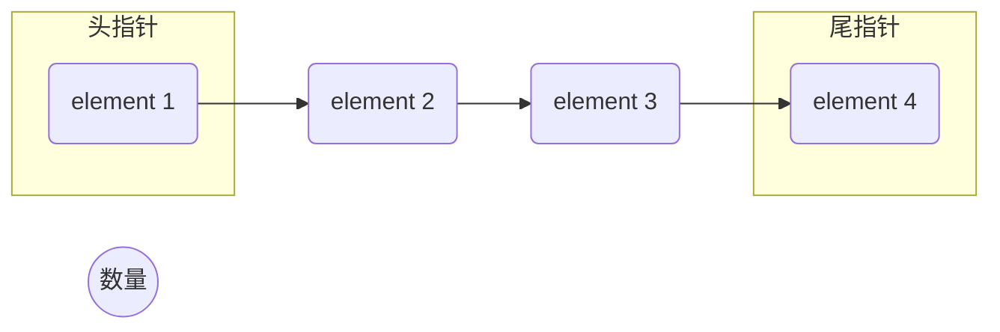
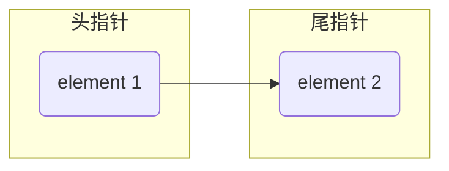
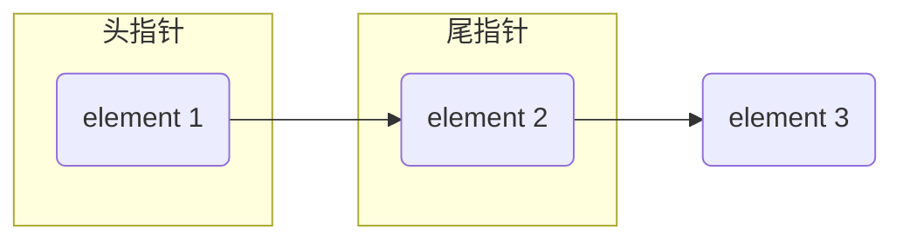
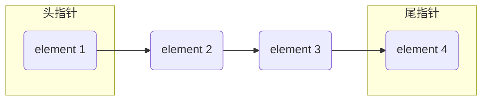

### 概要说明

前面我们分析了ArrayBlockingQueue和LinkedBlockingQueue。前面的两个队列都是阻塞队列，而ConcurrentLinkedQueue则是非阻塞队列。

阻塞队列和非阻塞队列的主要区别主要体现在功能层面：

当队列空间已满或者队列为空的场景下，消费者/生产者是否会阻塞。

从代码层面主要是看这个队列是否有实现BlockingQueue接口。其实阻塞队列和非阻塞队列的界定不是很明显，因为阻塞队列很容易就可以改造成非阻塞队列（把wait逻辑去掉，直接返回一个空对象）。同样，非阻塞队列要改造成阻塞队列也很简单，只需要增加一个Condition来对生产者和消费者来进行阻塞和唤醒的操作。因此阻塞队列和非阻塞队列并非一成不变的，很有可能哪一天开发者会扩展或者改造类的实现，因此我们后面的讨论更多是在性能上。

ConcurrentLinkedQueue相比较LinkedBlockingQueue最大的特点是性能的优化。我们可以发现，不管是ArrayBlockingQueue还是LinkedBlockingQueue，都需要维护几个核心的变量。

- 头指针
- 尾指针
- 元素的数量




我们假设需要增加一个元素5，需要有3步操作。

1. 把element 4的next指针指向一个新的元素element 5
2. 修改尾指针指向element 5
3. 修改元素的数量+1

为了保证这3个步骤的数据的一致性，我们需要通过锁来保证这3个操作的原子性。我们知道在并发场景下，锁是导致性能下降的主要原因，那么有没有办法把这个锁去掉？

ConcurrentLinkedQueue是这么做的：

- 不维护元素的数量(size()方法需要遍历整个链表，效率是O(n)，这个方法几乎也是不建议使用)
- 维护头指针和尾指针，但这两个指针并不是实时更新，甚至更新失败也不影响正常的出入队列。
- 相对的 入队-队尾的next指针修改，出队-队首的元素设置为空，这两个操作使用CAS来保证线程安全。

### 入队操作

```java
public boolean offer(E e) {
        checkNotNull(e);
        final Node<E> newNode = new Node<E>(e);

        for (Node<E> t = tail, p = t;;) {
            Node<E> q = p.next;
            if (q == null) {
                // p is last node
                if (p.casNext(null, newNode)) {
                    // Successful CAS is the linearization point
                    // for e to become an element of this queue,
                    // and for newNode to become "live".
                    if (p != t) // hop two nodes at a time
                        casTail(t, newNode);  // Failure is OK.
                    return true;
                }
                // Lost CAS race to another thread; re-read next
            }
            else if (p == q)
                // We have fallen off list.  If tail is unchanged, it
                // will also be off-list, in which case we need to
                // jump to head, from which all live nodes are always
                // reachable.  Else the new tail is a better bet.
                p = (t != (t = tail)) ? t : head;
            else
                // Check for tail updates after two hops.
                p = (p != t && t != (t = tail)) ? t : q;
        }
    }
```

为了方便理解，先考虑在单线程环境下这个方法会如何执行。

#### 单线程

假设队列的初始状态如下：




插入element 3

1. t,p均指向tail(队尾)，则在循环的开始q必然为null
2. p.casNext(null, newNode)，p的next指针指向新的结点
3. 这时候p必然等于t，所以不会执行casTail方法，也就是tail的指针还是不变
4. 返回成功

我们得到的结果如下：



这里肯定有人会奇怪，尾指针不是错了吗。前面我们提到，ConcurrentLinkedQueue不保证尾指针的准确性，甚至在并发场景下更新失败也无所谓，下面我们继续看下它是如何处理的。

插入element 4

1. t,p均指向tail(队尾)，但是由于tail指针是还是旧的位置，因此p(指向element 3)这时候不为空
2. 我们看到第二个判断分支 else if (p == q)，也就是p的next指针指向自己，这里我们先不讨论为什么出现这种场景。条件不满足，跳到第三个分支
3. 由于p==t，因此最终执行p=q，即p移向下一个结点，继续循环
4. Node<E> q = p.next;q为空，执行第一个判断分支的插入操作
5. p.casNext(null, newNode) 写入成功
6. 由于p!=t，更新tail指针
7. 返回成功

最终执行后的结果如下：



我们可以看到尾指针至少跳2次以上才会更新("至少"是因为casTail在并发场景下有可能会失败)。

#### 多线程

我们看下在并发场景下，哪些步骤会有变更？

- p.casNext(null, newNode)

并发场景下只有一个线程能修改成功，修改失败则会回到循环开始。

```java
Node<E> q = p.next;
```

由于另外一个线程已经插入成功，则q不为空。跳到第三个分支，执行p=q(往下一个结点移动)。这时候p已经成功指向队尾，如果不存在另外一个线程竞争，那么这次将插入成功。

- casTail(t, newNode);  // Failure is OK.

由于tail指针不需要维护一个准确的值，因此这里更新失败也不会影响到整体流程

### 出队操作

```java
public E poll() {
        restartFromHead:
        for (;;) {
            for (Node<E> h = head, p = h, q;;) {
                E item = p.item;

                if (item != null && p.casItem(item, null)) {
                    // Successful CAS is the linearization point
                    // for item to be removed from this queue.
                    if (p != h) // hop two nodes at a time
                        updateHead(h, ((q = p.next) != null) ? q : p);
                    return item;
                }
                else if ((q = p.next) == null) {
                    updateHead(h, p);
                    return null;
                }
                else if (p == q)
                    continue restartFromHead;
                else
                    p = q;
            }
        }
    }
```

思路跟入队类似，这里就不再重复。

#### 获取数据大小

既然Head和Tail这两个指针都不是一个准确的数据，并且没有维护一个元素数量的计数器，那么size()方法是怎么做到的呢？

聪明的你可能已经想到了，就是遍历整个链表来进行计算的。

```java
public int size() {
        int count = 0;
        for (Node<E> p = first(); p != null; p = succ(p))
            if (p.item != null)
                // Collection.size() spec says to max out
                if (++count == Integer.MAX_VALUE)
                    break;
        return count;
    }
```

> <p>Beware that, unlike in most collections, this method is
> <em>NOT</em> a constant-time operation. Because of the
> asynchronous nature of these queues, determining the current
> number of elements requires an O(n) traversal.
> Additionally, if elements are added or removed during execution
> of this method, the returned result may be inaccurate.  Thus,
> this method is typically not very useful in concurrent
> applications.

不同于大部分的队列，这个方法不是一个固定时间的操作O(1)，它取决于队列元素的大小，性能复杂度为O(n)。因此这个方法在实际使用中并没有太大作用。

### 总结

ConcurrentLinkedQueue在LinkedBlockingQueue的基础上做了比较多的改进，虽然本质上还是使用链表进行存储，牺牲head,tail和count的准确性，换取入队和出队的性能提升。

### 参考文献

[ConcurrentLinkedQueue源码分析](https://www.jianshu.com/p/7816c1361439)