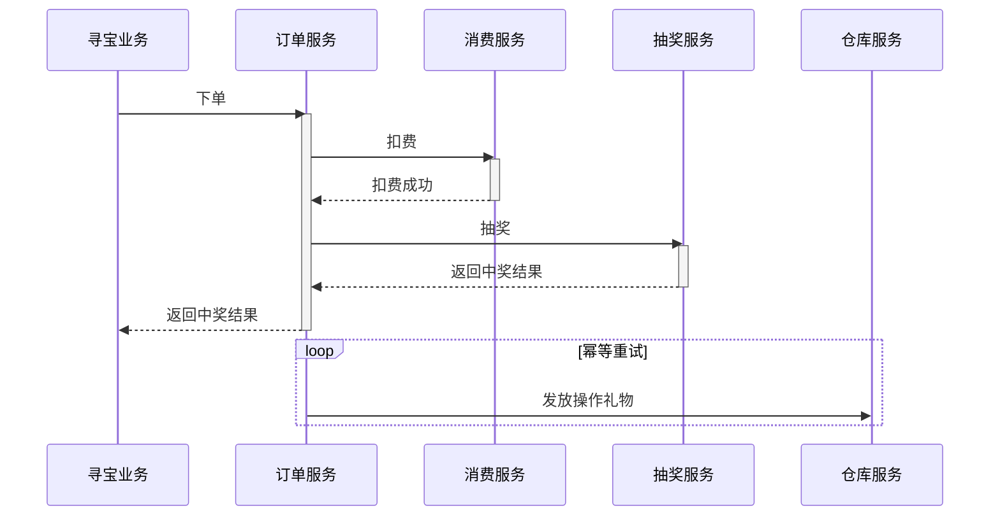
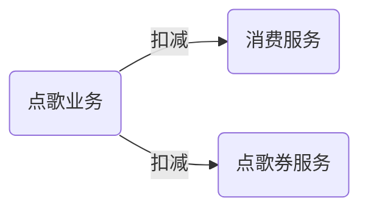
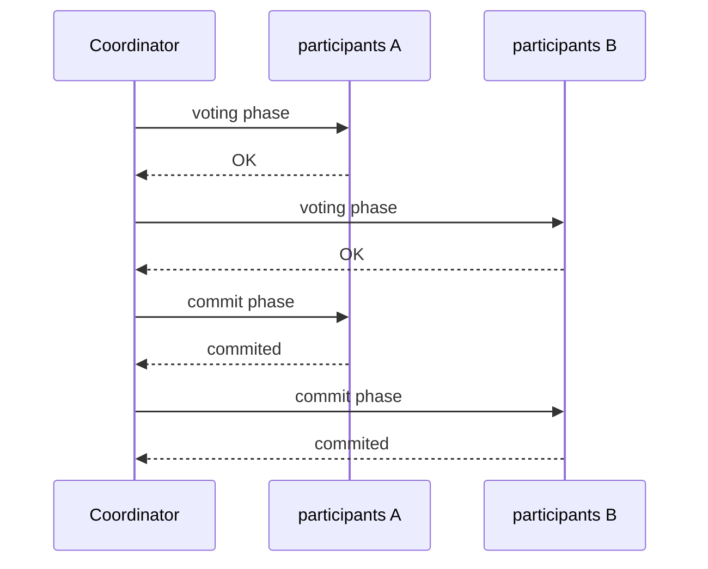
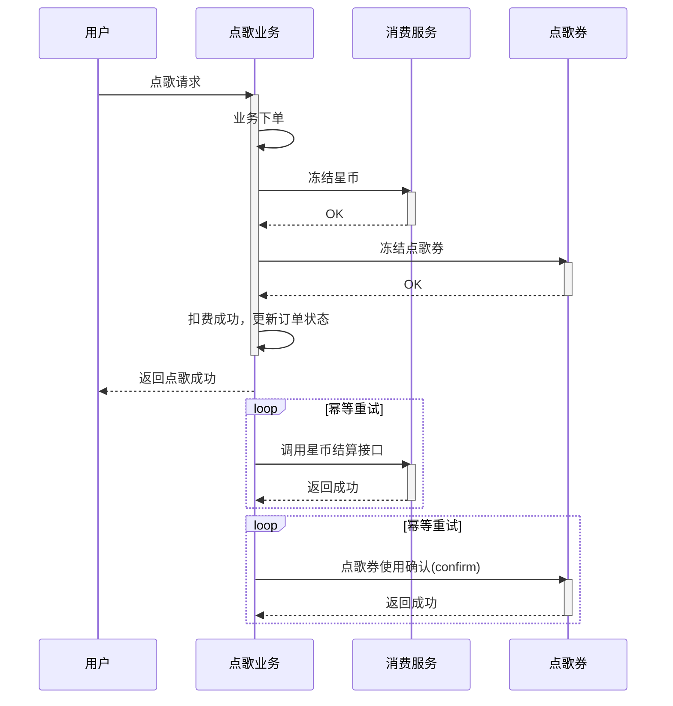
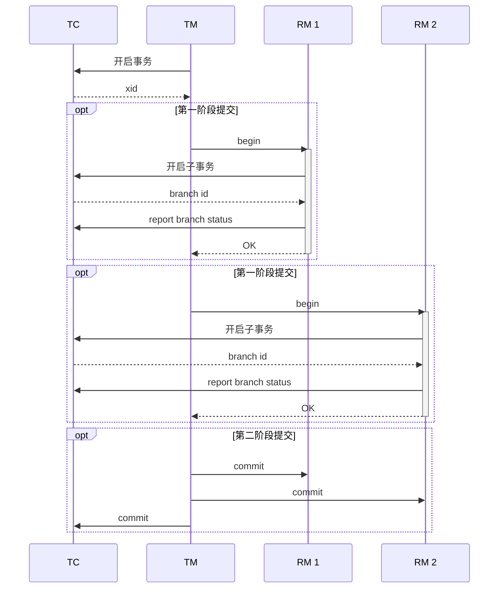

大纲：

### 一致性问题的痛点

1. 什么是数据一致性问题
2. 一致性问题是怎么产生(网络、硬件、程序)

### 解决方案：最终一致性，2PC，多数派协议(paxos,raft)

### 最终一致的常见解决方案

- 幂等
- 重试

点歌券业务

### 两段提交

分布式事务

- 点歌券/塔防
- fescar

### (paxos、raft等)多数派协议

- 双写会带来数据的不一致(重点讲下之前的那次故障)

- 脑裂(split-brain问题)
- mha架构如何解决脑裂问题

### 后续展望

