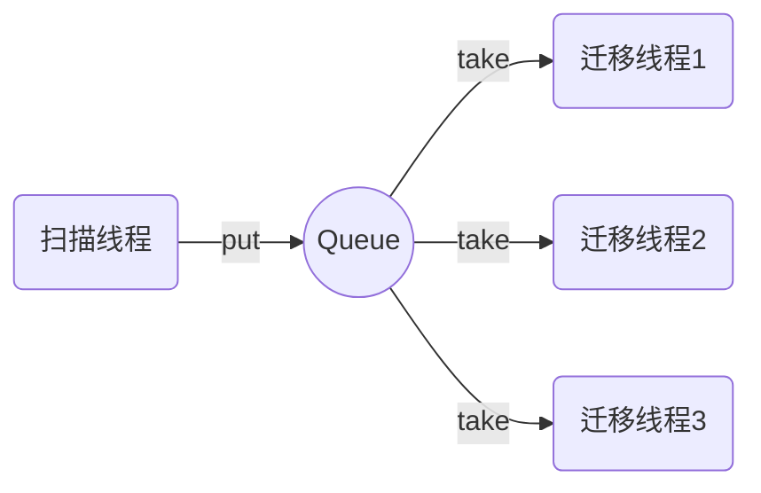

在业务开发中我们往往会遇到一个问题，消费者的处理能力和生产者的速度不匹配。一旦生产者的速度超过消费者的处理速度，会造成消息堆积，极端的场景甚至会造成OOM。理想的情况是，如果消费者的处理速度跟不上，我们把生产者的速度也相应调小，从而保证生产者和消费者的速度匹配。

举一个业务场景：

在做用户数据迁移的时候我们希望通过一个队列来解耦扫描线程和迁移线程。



在没有很好地评估扫描线程的生产速度的时候，有可能会造成队列的堆积。一个比较好的做法是通过TransferQueue来控制生产者的速度，如果消费者消费太慢，这时候生产者选择阻塞等待来放慢整个的生产速度。如果我们想提高系统的吞吐量，我们只需要增加消费者的数量/处理性能，直到把生产者的写入性能耗尽。

LinkedTransferQueue

```java
public class LinkedTransferQueueDemo {
    static LinkedTransferQueue<String> lnkTransQueue = new LinkedTransferQueue<String>();
    public static void main(String[] args) {
        ExecutorService exService = Executors.newFixedThreadPool(2);
        Producer producer = new LinkedTransferQueueDemo().new Producer();
        Consumer consumer = new LinkedTransferQueueDemo().new Consumer();
        exService.execute(producer);
        exService.execute(consumer);
        exService.shutdown();
    }
    class Producer implements Runnable{
        @Override
        public void run() {
            for(int i=0;i<3;i++){
                try {
                    System.out.println("Producer is waiting to transfer...");
                    lnkTransQueue.transfer("A"+i);
                    System.out.println("producer transfered element: A"+i);
                } catch (InterruptedException e) {
                    e.printStackTrace();
                }
            }
        }
    }
    class Consumer implements Runnable{
        @Override
        public void run() {
            for(int i=0;i<3;i++){
                try {
                    System.out.println("Consumer is waiting to take element...");
                    String s= lnkTransQueue.take();
                    System.out.println("Consumer received Element: "+s);
                } catch (InterruptedException e) {
                    e.printStackTrace();
                }
            }
        }
    }
}
```

运行结果：

```java
Producer is waiting to transfer...
Consumer is waiting to take element...
Consumer received Element: A0
Consumer is waiting to take element...
producer transfered element: A0
Producer is waiting to transfer...
producer transfered element: A1
Producer is waiting to transfer...
Consumer received Element: A1
Consumer is waiting to take element...
Consumer received Element: A2
producer transfered element: A2
```

### 参考文献

[Java并发编程之LinkedTransferQueue阻塞队列详解](https://blog.csdn.net/qq_38293564/article/details/80593821)

[Padded优化LinkedTransferQue并发性能是错误方向](https://my.oschina.net/wenshao/blog/90508)

[TransferQueue实例](https://www.jianshu.com/p/b3e97770c551)

[ Java 7中的TransferQueue ](http://ifeve.com/java-transfer-queue/)

[SynchronousQueue 源码分析](https://www.jianshu.com/p/95cb570c8187)