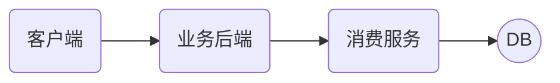
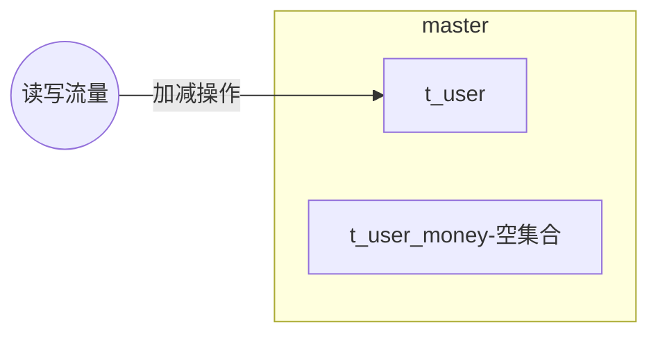
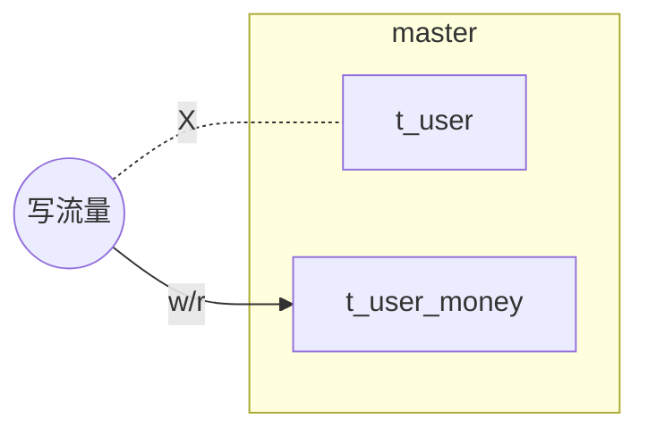
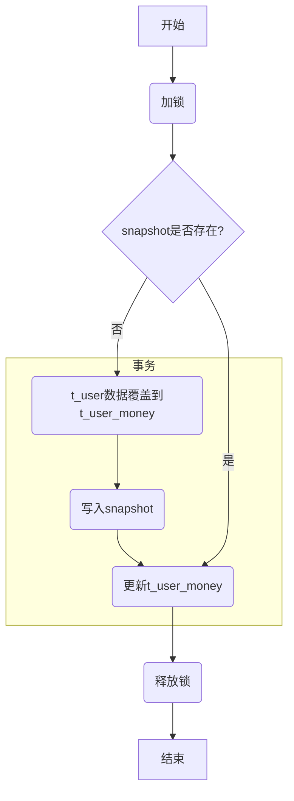

### 摘要

直播业务的用户余额表(星币星豆)为亿级的用户量，目前单表已经无法满足日益增长的业务需求。18年初已经发生多次慢查导致的业务故障，业务上迫切需要对用户余额表进行分表，减轻数据库的压力和提升系统性能。本文提出一种平滑分表的方案，不停服、支持灰度迁移且支持故障止损。该方案不影响线上业务并且极大地减少数据迁移的风险。

### 一、现状&问题

消费服务封装了涉及到用户星币星豆的所有行为操作，是直播营收业务的一个核心基础服务。用户余额表是一个亿级的大表，单表已经无法满足日益增长的业务需求。



慢查会直接影响到上游的业务后端和消费后的下游业务。具体表现为：

- 上游业务丢单。业务调用扣费超时，导致后续的业务流程中断。eg.寻宝业务扣费后没有走发奖流程。
- 消费后业务丢单/延时到账。eg.榜单丢单，加星豆到账延时
- 用户体验受损。送礼特效、接口超时返回网络异常等

分表解决的问题/目标：
- 减少单表存储的数量级，提高**查询效率**
- **期初期末审计需要**。需要在余额表增加一个最后更新时间(updateTime)的字段
- 余额表主键改为kugouid，目前余额表的主键是userid，需要增加一个idmapping的转换。改造后可以**减少一次rpc请求**
- **表设计规范化**。删掉不必要字段，金钱相关字段统一改为decimal，索引规范化。
- 为未来**分库**做准备

### 二、国内外研究现状

业界分表的主流解决方案主要有下面几种：

- 停服迁移
- 双写迁移
- 存量数据+增量数据迁移

#### 2.1 停服迁移

最简单粗暴数据迁移方式，主要流程如下：

- 停服禁写
- 使用迁移程序将数据迁移到新表
- 数据&功能验收
- 恢复服务

这种方式的优点是简单，并且不需要担心程序并发带来的数据不一致的场景。缺点也很明显，停服的时间比较长，如果是公司的营收业务，停服意味着公司的损失，在大公司这种方式并不可取。

#### 2.2 双写迁移

双写迁移把写入新表和旧表的操作绑定在同一个事务，从而保证新表的旧表的数据一致性。最终我们只需要把读流量迁移到新表即可。

图-双写迁移

优点：

- 数据回滚成本低。由于新旧表余额保持一致，因为回滚只需要把读流量迁移到旧表即可

缺点：

- 写操作多写入了一张表，因此灰度过程中接口的写性能会有所影响。

#### 2.3 存量数据+增量数据迁移

大致流程如下：

- 通过dump的方式获得余额表S1某一个时间点的快照(snapshot)，并且记录下binlog的位点
- 根据余额表的快照表 通过 分表的映射规则 得到分表数据S2，这时候S2的数据落后于S1
- 通过订阅binlog的方式把S2落后的binlog追回，这时候S1和S2的数据是等级
- 停服禁写
- 等待binlog完全同步到S2(大概1~2s的时间)
- 数据&功能验收
- 恢复服务

优点：

- 停服的时间相对比较短。这里说的是相对，由于切换后我们需要对数据和功能进行校验，对于亿级的用户，数据校验的耗时也是一个问题点。
- 接口性能好。由于不需要写入额外的表，因此不会对线上的接口性能造成影响。

缺点：

- 缺少灰度方案
- 回滚成本高。切换后一旦发现异常需要回滚到旧版本，会丢失切换后所有新增数据(等价于回滚到切换前的版本)

### 三、亮点

本文的亮点在于提出了一种不停服、支持灰度、且对线上业务不影响(影响较小)的分表方案。

- 无需停服平滑迁移
- 支持灰度
- 对线上接口性能影响很小
- 准实时的数据一致性校验
- 支持数据异常回滚

### 四、方案设计

数据迁移的方案主要分为4大部分

- 热点数据迁移
- 冷数据迁移
- 准实时数据一致性校验
- 数据异常回滚

#### 4.1 热点数据迁移

用户的写流量触发用户的余额迁移，这里有几个关键的技术点

- 如何保证迁移过程中余额不会被修改(并发)
- 迁移失败/异常的解决方案
- 支持用户的灰度方案

##### 4.1.1 迁移前

 新建t_user_money表，这时候t_user_money表没有任何数据。 



##### 4.1.2 写流量迁移

用户的写流量会触发用户的余额迁移



在流量切换的过程中，我们可以通过一个简单的灰度开关进行灰度。

考虑到回滚需要，我们需要有一个快照表(snapshot)来记录迁移后的用户。

读写流量迁移流程：



迁移锁

由于用户余额迁移需要保证迁移过程中t_user表的数据不被其它线程/进程修改，我们需要一个锁来保证我们数据的一致性。

分布式锁一般考虑使用一个缓存的中间件实现(redis/memcache)，然而redis无法严格地保证锁只会被一个线程获取

- 数据丢失风险。redis在极端情况下有可能会丢失1s的数据
- 数据淘汰
- 锁超时。eg.A线程抢锁成功，假设锁的超时时间为2s，然而A的业务处理时间耗费了5s，假设在第三秒的时候有一个新的请求介入，由于前面锁已经超时，则B线程也能获取锁成功。

因此我们考虑使用redis锁+db行锁的方式来解决。

图-redis锁+db行锁

##### 4.1.3 代码组织


图1 UML图

我们把所有涉及到余额的表的操作统一抽象到IUserManager这个接口，这个接口有3个实现类。

- IUserManager

封装所有的涉及到余额表操作的接口

- UserManager

封装用户余额表的所有操作

- UserMoneyManager

封装分表后所有余额表的所有操作

- UserManagerWrapper

代理类。根据灰度百分比控制流量的写入。

```java
/**
 * 封装数据库的DAO操作
 * @author 李泳权
 * @Date: 2019/10/31 15:38
 * @Description:余额表变更接口
 */
public interface IUserManager {
    /**
     * 用户初始化
     * @param kugouId
     * @return
     * 用户初始化结果
     */
    boolean init(long kugouId);
    /**
     * 扣减用户星币
     * @param kugouId
     * kugouId
     * @param coin
     * 星币
     * @param money
     * 真实星币
     * @return
     * 更新行数
     */
    int deduct(long kugouId,BigDecimal coin,
                      BigDecimal money);
    /**
     * 充值增加星币
     * @param kugouId
     * kugouId
     * @param money
     * 真实星币
     * @return
     * 更新行数
     */
    int recharge(long kugouId,BigDecimal money);
    ...
}
```

#### 4.2 冷数据迁移

由于


