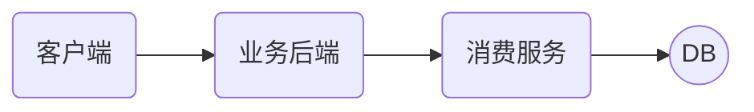
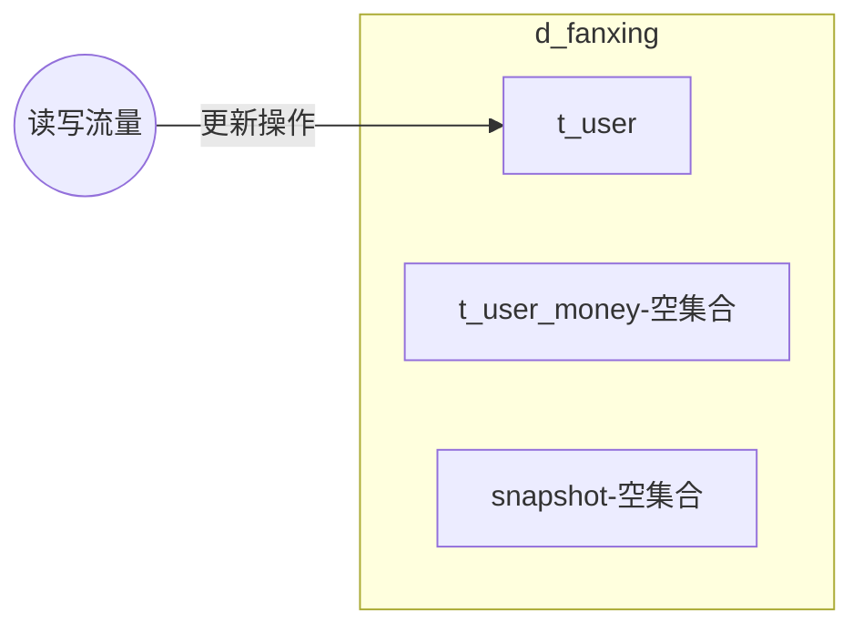
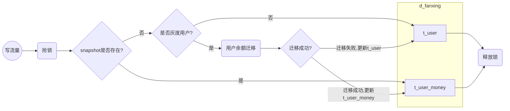
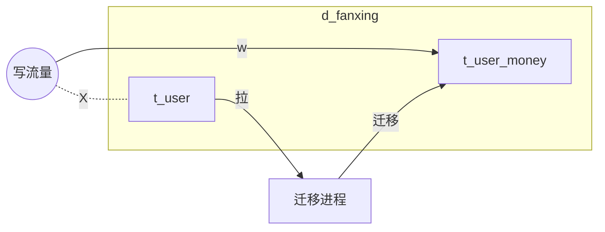
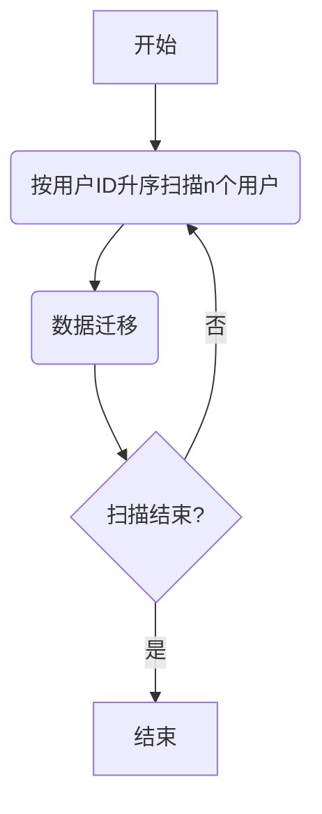
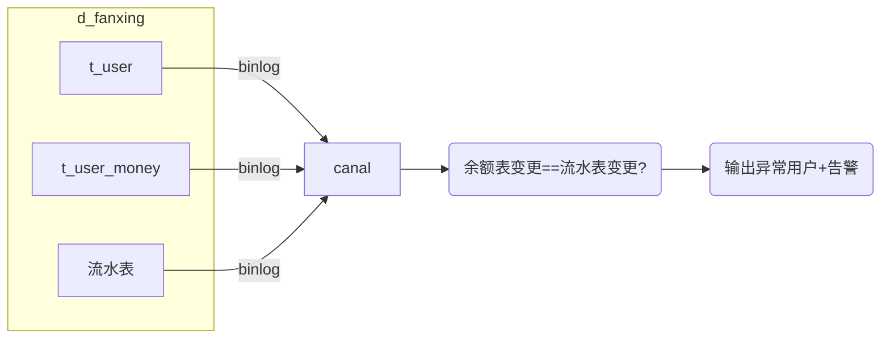
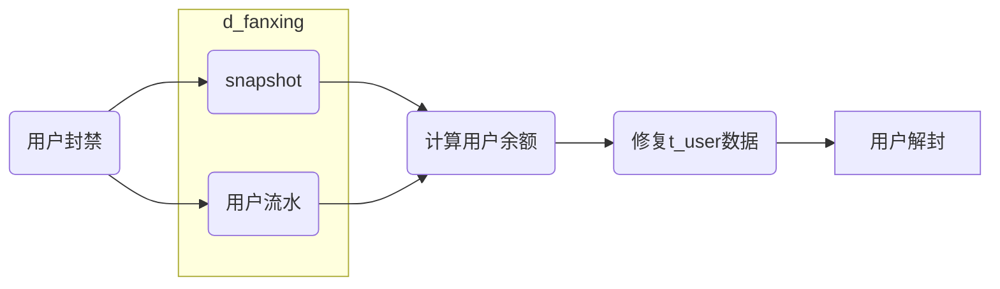

### 摘要

直播业务的用户余额表(星币星豆)为亿级的数据量，营收日均订单量为千万级别，随着直播业务的发展，余额表单表架构已经成为消费模块的核心瓶颈之一。在2018年初已经发生多次慢查导致的业务故障，我们迫切需要对用户余额表进行分表，减轻数据库的压力和提升系统性能。本文提出一种平滑分表的方案，不停服、支持灰度和数据回滚。该方案不影响线上业务并且能够极大地降低数据迁移的风险。

### 一、现状&问题

消费服务是直播营收业务的核心基础服务，封装了用户星币星豆的所有基础行为操作。用户余额表是一个亿级的大表，单表已经无法满足日益增长的业务需求。



慢查会直接影响到上游的业务后端和消费后的下游业务。具体表现为：

- 上游业务丢单。业务调用扣费超时，导致后续的业务流程中断。eg.寻宝业务扣费后没有走发奖流程。
- 消费后业务丢单/延时到账。eg.榜单丢单，加星豆到账延时
- 用户体验受损。用户送礼后送礼特效丢失、用户点击寻宝提示网络异常等

分表解决的问题/目标：
- 减少单表存储的数量级，提高**查询效率**
- **期初期末审计需要**。需要在余额表增加一个最后更新时间(updateTime)的字段
- 余额表主键改为kugouid，目前余额表的主键是userid，需要增加一个idmapping的转换。改造后可以**减少一次rpc请求**
- **表设计规范化**。删掉不必要字段，金钱相关字段统一改为decimal，索引规范化。
- 为未来**分库**做准备

### 二、国内外研究现状

业界分表的主流解决方案主要有下面几种：

- 停服迁移
- 双写迁移
- 存量数据+增量数据迁移

#### 2.1 停服迁移

简单粗暴的数据迁移方式，主要流程如下：

- 停服
- 使用迁移程序将数据迁移到新表
- 数据&功能验收
- 恢复服务
- 删除旧表

这种方式的优点是简单，并且不需要担心并发带来的数据不一致的场景。然而缺点也很明显，停服的时间长，停服的时间取决于数据迁移的时间和功能验收时间。如果表的数据量比较大(亿级)，停服的时间甚至需要好几个小时。营收业务的停服意味着公司的直接损失，因此在一些比较大的互联网公司这种方式并不可取。

#### 2.2 双写迁移

双写迁移把写入新表和旧表的操作绑定在同一个事务，从而保证新表的旧表的数据一致性。在数据迁移完成后把读流量迁移到新表。

图-双写迁移

主要流程如下：

- 用户写流量同时更新旧表和新表(事务保证一致性)
- 迁移程序把存量的用户迁移到新表
- 读流量迁移到新表
- 删除旧表以及涉及到写旧表的业务代码

优点：

- 数据回滚成本低。由于新旧表数据保持一致，回滚只需要把读流量迁移到旧表即可

缺点：

- 写操作多写入了一张表，灰度过程中接口的性能会有所影响。

#### 2.3 存量数据+增量数据迁移

通过某一个时间点T1的快照数据(存量数据)+增量数据可以得到任意时间点T2(T2>T1)的数据集合。

这里的快照数据我们可以通过mysql dump的方式得到，增量数据可以通过binlog的监听工具canal实现。

主要流程如下：

- 通过dump的方式获得表S1某一个时间点的快照(snapshot)，并且记录下binlog的位点p
- 快照表 通过 分表的映射规则 得到分表数据S2，注意这时候S2的数据落后于S1
- 通过canal订阅binlog，把位点p以后binlog回放到S2，最终S1和S2的达到数据一致
- 停服禁写
- 等待binlog完全同步到S2(大概1~2s的时间)
- 读写切换到新表
- 数据&功能验收
- 恢复服务

优点：

- 停服的时间相对较短。注意这里说的是相对，由于切换后我们需要对数据和功能进行校验，对于亿级的用户，数据校验的耗时也是一个痛点。
- 不影响线上接口性能。由于不需要额外写入/查询表，因此不会对线上的接口性能造成影响。

缺点：

- 缺少灰度方案。一旦切换失败会影响到全量的用户。
- 回滚成本高。切换后一旦发现异常需要回滚到旧版本，会丢失切换后所有新增数据(等价于回滚到切换前的版本)

### 三、亮点

本文的亮点在于提出了一种无需停服、支持灰度、且对线上业务影响较小的分表方案。

- 无需停服平滑迁移
- 支持灰度
- 对线上接口性能影响小(仅增加一个查询)
- 准实时的数据一致性校验
- 支持数据异常回滚

### 四、方案设计

分表方案主要分为5部分

- 数据裁剪
- 热点数据迁移
- 冷数据迁移
- 数据一致性校验
- 数据异常回滚

#### 4.1 数据裁剪

我们先思考一个问题，余额表的用户数据都是必要存在的吗？

付费用户定义：

余额(星币/星豆)不为0 || 有过付费行为 || 曾经收到星豆/星币 的用户

```sql
select * from t_user where coin!=0 or money!=0 or moneySpend!=0 or coinSpend!=0 or coinTotal!=0 or czTotal!=0 or bean!=0 or beanTotal!=0;
```

余额表关注的用户数据是付费用户，已注册但没有付费行为的用户我们不需要关注。付费用户占总体用户占比约12%，因此我们数据迁移的数据量由亿级下降到千万级别，大大缩短我们数据迁移的时长。

#### 4.2 热点数据迁移

用户的写流量触发用户的余额迁移，这里有几个关键的技术点

- 如何保证迁移过程中余额不会被修改(并发)
- 支持按用户灰度

在开始迁移前先介绍一下几张核心的表。

- t_user

用户余额表(分表前)

- t_user_money_${partition}

用户余额表(分表后)

- snapshot

用户余额快照表。用户余额从t_user迁移到t_user_money会写入快照表。快照表的作用主要有两个，数据异常回滚和标识当前用户是否已经迁移成功。

##### 4.1.1 初始状态

 新建t_user_money表，这时候t_user_money表没有任何数据。 



##### 4.1.2 写流量开关控制

用户的写流量会触发用户的余额迁移。迁移完成后对这个用户所有的余额更新的操作都会写到t_user_money。



整体流程如上图所示：

- 当快照表已经存在，则认为用户已经迁移成功，写入t_user_money
- 当快照表不存在，则判断当前用户是否灰度用户，如果不为灰度用户，写入t_user
- 若当前用户为灰度用户，则会触发一次余额迁移。若迁移成功，写入t_user_money，迁移失败，写入t_user。

由于灰度后的用户只需要增加一个查询(snapshot)，可以通过缓存的方式最大程度的减少对线上服务性能影响。

随着灰度比例的增加，最终所有的热点用户都会迁移到新表(t_user_money)。

##### 4.1.3 余额迁移流程

余额迁移的结果直接影响到用户的写流量最终会写入哪张表，如果迁移的结果不准确会导致用户的余额错乱，因此我们必须保证迁移结果的准确性。迁移流程需要满足以下几个要求：

- 幂等。多次迁移跟一次迁移的结果一致
- 线程安全。迁移过程中必须保证余额不能被修改，这里我们通过数据库的悲观锁实现(select for update)
- 事务完整性。迁移失败后需要把快照表和t_user_money一并回滚

余额迁移流程：

```mermaid
graph TD
开始-->C1{snapshot是否存在?}
C1-->|否|L(加锁,db行锁)
L-->B(t_user数据覆盖到t_user_money)
B-->C(写入snapshot)
C-->C2{迁移成功?}
C2-->|失败|D(查询snapshot,二次确认)
D-->R
C2-->|成功|R(释放锁)
C1-->|是,返回迁移成功|结束
R-->结束
subgraph 子事务,事务传递等级NEST,回滚不会影响到外层事务
L
B
C
R
C2
D
end
```

##### 4.1.4 锁选型

由于用户余额迁移需要保证迁移过程中t_user表的数据不被其它线程/进程修改，我们需要分布式锁来确保我们数据的一致性。

乐观锁

缓存中间件的实现方式(redis/memcache)：redis无法严格地保证锁只会被一个线程获取。

- 数据丢失风险。redis在极端情况下有可能会丢失1s的数据
- 数据淘汰
- 锁超时。eg.A线程抢锁成功，假设锁的超时时间为2s，然而A的业务处理时间耗费了5s，假设在第三秒的时候有一个新的请求介入，由于前面锁已经超时，则B线程也能获取锁成功。

数据库乐观锁

t_user缺少一个版本号的字段，而且由于数据量大，无法直接对线上表做加字段等操作。

悲观锁

select for update实现方式，会阻塞其他等待的用户线程，严格保证迁移过程中数据不会被更新。对于每个用户只会迁移一次，因此对接口性能的损耗可以忽略。

最终我们考虑使用db行锁的方式来解决。

#### 4.3 冷数据迁移

 热点数据迁移灰度100%之后，t_user表不会再进行更新，这时候t_user表就是一个冷数据。我们扫描完整个t_user表就能完成整个迁移过程。 



 同样，在写t_user_money的过程中需要加锁。数据迁移的逻辑跟写流量迁移的逻辑一致。这里可以为了提高迁移效率可以多个定时任务分片处理。 



冷数据迁移有几个关键点：

- 冷数据的数据量庞大，如何提升迁移速度？

数据分片。根据用户ID分片迁移

- 数据写入的过程会导致线上主库的IO上升，如何减少对线上业务的影响？

业务闲时迁移。

分布式作业调度系统saturn可以很好地解决这两个问题。

#### 4.4 数据一致性校验

本方案的一个亮点在于实现了余额表的准实时一致性校验。

- 准实时的用户的数据一致性校验
- 不影响线上业务

对于非活跃用户(在迁移过程中没有产生付费行为)，由于不存在并发，我们认为数据的准确性在于数据拷贝代码逻辑的正确性，这块我们可以通过单元测试来保证，不需要另外通过程序进行验证，因此数据校验的核心在于对**活跃用户的数据校验**。

我们利用期初期末统计的方式对余额表的正确性做校验。

期初期末的思路：余额表期初+流水的变更=余额表的期末

通过把等式左右的内容变更一下，可以得到 流水的变更=余额表的期末-余额表期初，等价于 余额表变更=流水表的变更



图-数据校验说明

#### 4.5 数据异常回滚

正常情况下，数据一致性校验能够把数据迁移过程中的异常场景尽早地发现，我们希望能够把故障控制在测试验收和白名单验收的阶段。一旦数据迁移后出现数据错乱/异常的情况下，我们需要一个及时止损的方案。

 我们通过流水和余额快照把用户的余额恢复。



由于修复需要通过快照+回放用户的流水实现，灰度的时间越长，回滚所需要的时间越长。

### 五、代码设计


图1 UML图

我们把所有涉及到余额的表的操作统一抽象到IUserManager这个接口，这个接口有3个实现类。

- IUserManager

封装所有的涉及到余额表操作的接口

- UserManager

封装用户余额表的所有操作

- UserMoneyManager

封装分表后所有余额表的所有操作

- UserManagerWrapper

代理类。根据灰度百分比控制流量的写入。

```java
/**
 * 封装数据库的DAO操作
 * @author 李泳权
 * @Date: 2019/10/31 15:38
 * @Description:余额表变更接口
 */
public interface IUserManager {
    /**
     * 用户初始化
     * @param kugouId
     * @return
     * 用户初始化结果
     */
    boolean init(long kugouId);
    /**
     * 扣减用户星币
     * @param kugouId
     * kugouId
     * @param coin
     * 星币
     * @param money
     * 真实星币
     * @return
     * 更新行数
     */
    int deduct(long kugouId,BigDecimal coin,
                      BigDecimal money);
    /**
     * 充值增加星币
     * @param kugouId
     * kugouId
     * @param money
     * 真实星币
     * @return
     * 更新行数
     */
    int recharge(long kugouId,BigDecimal money);
    ...
}
```

### 六、总结

本文提出了一种不停服的平滑分表方案，支持灰度和故障止损，不影响线上业务并且极大减少数据迁移的风险。该方案适用于其他营收资产业务，

### 七、展望

数据一致性校验可以适用于其他营收资产类的业务，从而实现一个通用的准实时的期初期末模型。分表的方案也同样适用于其他营收资产业务(eg.仓库服务)。

### 参考文档

canal

saturn

cache aside patten


