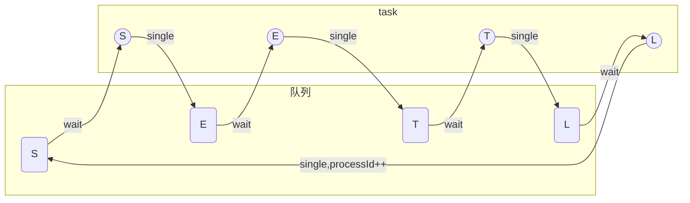

在S/E/T/L的核心流程中，我们都看到ArbitrateEventService，目前我了解到的作用主要有两个。

- 热备控制。保证某一时刻有且只有一个结点运行。
- 并行度控制。对于E/T两个并行的流程，起到一个类似锁的作用，保证某一时刻只有N个线程并行(类似HTTP的滑动窗口，假设并行度为N，同一时刻允许最多有N个未确认的请求，第N+1的请求需要等第一个请求ACK后才能发起)

### ArbitrateEventService初始化

`ArbitrateEventService`

```java
/**
 * 仲裁器事件处理的service，使用者可关注相应的await/single两个方法
 * 
 * @author jianghang 2011-8-9 下午04:39:49
 */
public interface ArbitrateEventService {

    public MainStemArbitrateEvent mainStemEvent();

    public SelectArbitrateEvent selectEvent();

    public ExtractArbitrateEvent extractEvent();

    public TransformArbitrateEvent transformEvent();

    public LoadArbitrateEvent loadEvent();

    public TerminArbitrateEvent terminEvent();

    public ToolArbitrateEvent toolEvent();
}
```

ArbitrateEventService只有一个实现类ArbitrateEventServiceImpl，只是保留了一些基础的get/set方法。bean的初始化放在otter-arbitrate-event.xml的配置文件中。

```xml
<bean name="arbitrateEventService" class="com.alibaba.otter.shared.arbitrate.impl.ArbitrateEventServiceImpl" scope="singleton" />
...
<!-- delegate bean -->
	<bean name="selectEvent" class="com.alibaba.otter.shared.arbitrate.impl.setl.delegate.SelectDelegateArbitrateEvent" scope="singleton">
		<property name="delegate">
			<map>
				<entry key="MEMORY" value-ref="selectMemoryEvent" />
				<entry key="RPC" value-ref="selectRpcEvent" />
				<entry key="ZOOKEEPER" value-ref="selectZooKeeperEvent" />
			</map>
		</property>
	</bean>
	<bean name="extractEvent" class="com.alibaba.otter.shared.arbitrate.impl.setl.delegate.ExtractDelegateArbitrateEvent" scope="singleton" >
		<property name="delegate">
			<map>
				<entry key="MEMORY" value-ref="extractMemoryEvent" />
				<entry key="RPC" value-ref="extractRpcEvent" />
				<entry key="ZOOKEEPER" value-ref="extractZooKeeperEvent" />
			</map>
		</property>
	</bean>
	<bean name="transformEvent" class="com.alibaba.otter.shared.arbitrate.impl.setl.delegate.TransformDelegateArbitrateEvent" scope="singleton">
		<property name="delegate">
			<map>
				<entry key="MEMORY" value-ref="transformMemoryEvent" />
				<entry key="RPC" value-ref="transformRpcEvent" />
				<entry key="ZOOKEEPER" value-ref="transformZooKeeperEvent" />
			</map>
		</property>
	</bean>
	<bean name="loadEvent" class="com.alibaba.otter.shared.arbitrate.impl.setl.delegate.LoadDelegateArbitrateEvent" scope="singleton">
		<property name="delegate">
			<map>
				<entry key="MEMORY" value-ref="loadMemoryEvent" />
				<entry key="RPC" value-ref="loadRpcEvent" />
				<entry key="ZOOKEEPER" value-ref="loadZooKeeperEvent" />
			</map>
		</property>
	</bean>
```

S/E/T/L事件仲裁分别是通过SelectDelegateArbitrateEvent、ExtractDelegateArbitrateEvent、TransformDelegateArbitrateEvent、LoadDelegateArbitrateEvent四个代理类实现的。

### SelectDelegateArbitrateEvent 事件代理

`SelectDelegateArbitrateEvent `有3种模式。

- MEMORY
- RPC
- ZOOKEEPER

```xml
<property name="delegate">
			<map>
				<entry key="MEMORY" value-ref="selectMemoryEvent" />
				<entry key="RPC" value-ref="selectRpcEvent" />
				<entry key="ZOOKEEPER" value-ref="selectZooKeeperEvent" />
			</map>
		</property>
```

先看下SelectArbitrateEvent的核心方法。

```java
/**
 * 抽象select模块的调度接口
 * 
 * @author jianghang 2012-9-27 下午09:54:53
 * @version 4.1.0
 */
public interface SelectArbitrateEvent extends ArbitrateEvent {

    public EtlEventData await(Long pipelineId) throws InterruptedException;

    public void single(EtlEventData data);
}
```

这里有两个核心方法。`await`和`single`

- await

从管道(pipeline)获取数据

- single

类似ack操作

代理类的本质就是根据pipeline的配置，调用具体的实现类。

```java
/**
 * select delegate实现
 * 
 * @author jianghang 2012-9-28 上午10:36:38
 * @version 4.1.0
 */
public class SelectDelegateArbitrateEvent extends AbstractDelegateArbitrateEvent implements SelectArbitrateEvent {

    private Map<ArbitrateMode, SelectArbitrateEvent> delegate;

    public EtlEventData await(Long pipelineId) throws InterruptedException {
        return delegate.get(chooseMode(pipelineId)).await(pipelineId);
    }

    public void single(EtlEventData data) {
        delegate.get(chooseMode(data.getPipelineId())).single(data);
    }

    public void setDelegate(Map<ArbitrateMode, SelectArbitrateEvent> delegate) {
        this.delegate = delegate;
    }

}
```

#### SelectMemoryArbitrateEvent-内存仲裁

```java
   public EtlEventData await(Long pipelineId) throws InterruptedException {
       ...
        MemoryStageController stageController = ArbitrateFactory.getInstance(pipelineId, MemoryStageController.class);
        Long processId = stageController.waitForProcess(StageType.SELECT); // 符合条件的processId

        ChannelStatus status = permitMonitor.getChannelPermit();
        if (status.isStart()) {// 即时查询一下当前的状态，状态随时可能会变
            EtlEventData eventData = new EtlEventData();
            eventData.setPipelineId(pipelineId);
            eventData.setProcessId(processId);
            eventData.setStartTime(new Date().getTime());// 返回当前时间
            Long nid = ArbitrateConfigUtils.getCurrentNid();
            eventData.setCurrNid(nid);
            eventData.setNextNid(nid);
            return eventData;// 只有这一条路返回
        } else {
            ...
        }
    }

	public void single(EtlEventData data) {
        Assert.notNull(data);
        MemoryStageController stageController = ArbitrateFactory.getInstance(data.getPipelineId(),
                                                                             MemoryStageController.class);
        stageController.single(StageType.SELECT, data);// 通知下一个节点
    }
```

事实上调用到的核心类是`MemoryStageController`

```java
public Long waitForProcess(StageType stage) throws InterruptedException {
        if (stage.isSelect() && !replys.containsKey(stage)) {
            initSelect();
        }
        Long processId = replys.get(stage).take();
        if (stage.isSelect()) {// select一旦分出processId，就需要在progress中记录一笔，用于判断谁是最小的一个processId
            progress.put(processId, nullProgress);
        }
        return processId;
    }

    public synchronized boolean single(StageType stage, EtlEventData etlEventData) {
        boolean result = false;
        switch (stage) {
            case SELECT:
                if (progress.containsKey(etlEventData.getProcessId())) {// 可能发生了rollback，对应的progress已经被废弃
                    progress.put(etlEventData.getProcessId(), new StageProgress(stage, etlEventData));
                    replys.get(StageType.EXTRACT).offer(etlEventData.getProcessId());
                    result = true;
                }
                break;
            case EXTRACT:
                if (progress.containsKey(etlEventData.getProcessId())) {
                    progress.put(etlEventData.getProcessId(), new StageProgress(stage, etlEventData));
                    replys.get(StageType.TRANSFORM).offer(etlEventData.getProcessId());
                    result = true;
                }
                break;
            case TRANSFORM:
                if (progress.containsKey(etlEventData.getProcessId())) {
                    progress.put(etlEventData.getProcessId(), new StageProgress(stage, etlEventData));
                    result = true;
                }
                // 并不是立即触发，通知最小的一个process启动
                computeNextLoad();
                break;
            case LOAD:
                Object removed = progress.remove(etlEventData.getProcessId());
                // 并不是立即触发，通知下一个最小的一个process启动
                computeNextLoad();
                // 一个process完成了，自动添加下一个process
                if (removed != null) {
                    replys.get(StageType.SELECT).offer(atomicMaxProcessId.incrementAndGet());
                    result = true;
                }
                break;
            default:
                break;
        }

        return result;
    }
```

这里简单梳理下流程。

```java
private Map<StageType, ReplyProcessQueue> replys;
```

这里为每一个Stage(S/E/T/L)都维护了一个队列。

每个阶段的Task都是从对应的自己的队列中获取数据。`ReplyProcessQueue`是一个典型的阻塞队列。



#### RpcStageController-rpc模式

代码逻辑几乎跟`MemoryStageController`一样的？


